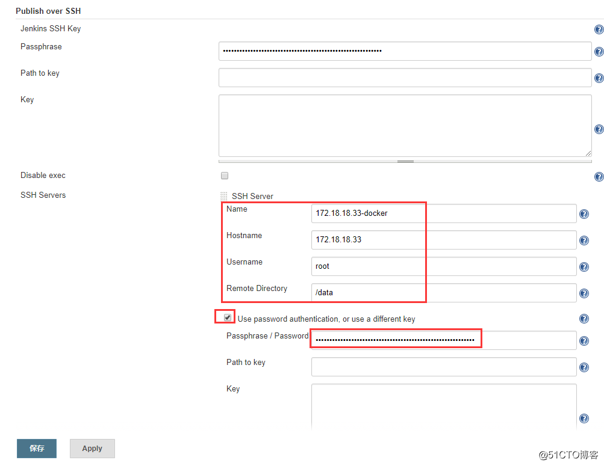
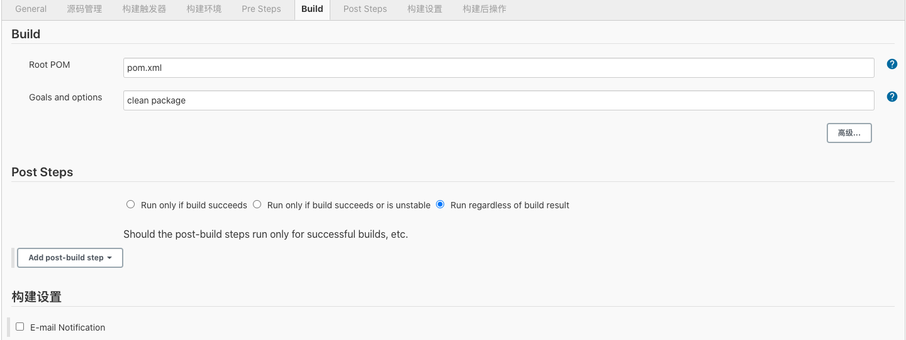
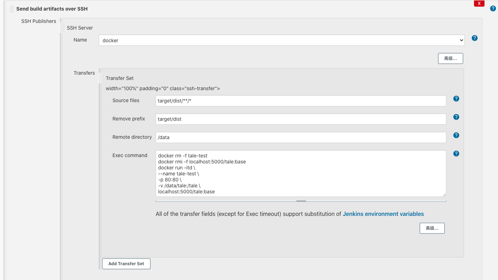

# 搭建基于Docker Jenkins的 CI 环境实现自动化部署

基于Docker+Jenkins+Git+registry实现一套CI自动化发布项目流程。

系统：macOS Catalina - 10.15.5

#### 基础环境
需要安装的软件：Docker, git, jdk, maven

首先 Docker 官网安装 Docker for Mac Desktop

`brew` 安装好 git，jdk，maven (maven先安装上，之后开发java项目可能会用)

配置环境变量 `~/.zshrc`

#### Jenkins+registry安装

原理上需要3个服务器起不同的服务，这里就一台Mac主机：
- registry服务器: 部署私有仓库
- jenkins服务器: 部署jenkins
- docker服务器: 项目容器

1. 部署 git 服务器
   
   这里就简单的用公司的 git 就好啦
   
   - 把本地的ssh-key添加到 git
   - 下载 table: `git  clone  https://github.com/otale/tale.git`
   - push到远程仓库：`git push origin master`
2. 部署docker私有仓库
  
   ```
    # registry安装，做这一步的目的是作为开发者， 自然会自己制作一些镜像， 在公司内网分发， 或者开发团队制作镜像， 然后交付给测试团队进行测试， 这就需要一个内部分发镜像的服务器， 这个 Docker 团队自然也想到了， 并且提供了一个镜像 retistry ， 先把这个镜像拉倒本地
    docker run --name devops-registry -p 5000:5000 -v $HOME/devdata/registry:/var/lib/registry -d registry
    # 测试devops-registry 中所有的镜像
    curl http://127.0.0.1:5000/v2/_catalog
   ``` 

3. 部署docker服务器

   3.1 配置 insecure-registries 
   `vim /etc/docker/daemon.json`
   ```
   {
     "registry-mirrors": [ "https://registry.docker-cn.com"],
     "insecure-registries": [ "127.0.0.1:5000"]
   }
   ```

   3.2 部署 jdk `brew cask install homebrew/cask/oracle-jdk` 
  
   3.3 构建tale开源博客镜像(该项目使用 maven 构建)
   `mkdir dockerfile_tale & cd dockerfile_tale/ & vim Dockerfile`
   
   `ENV PATH /usr/local/jdk/bin:$PATH` # 这条命令先不配
  
   Dockerfile: 
   ```
   FROM centos:7
   RUN yum install epel-release -y
   RUN yum install nginx supervisor -y && yum clean all
   RUN sed -i '47a proxy_pass http://127.0.0.1:9000;' /etc/nginx/nginx.conf
   COPY supervisord.conf /etc/supervisord.conf
   WORKDIR /tale
   CMD ["/usr/bin/supervisord"]
   ```
   
   supervisord.conf：
   ```
   [supervisord]
   nodaemon=true
   [program:tale]
   command=/usr/local/jdk/bin/java -jar /tale/tale-least.jar
   autostart=true
   autorestart=true
   [program:nginx]
   command=/usr/sbin/nginx -g "daemon off;"
   autostart=true
   autorestart=true
   ```
   
   构建镜像
   ```
   docker build  -t tale:base .
   docker images
   docker tag tale:base localhost:5000/tale:base
   docker push localhost:5000/tale:base
   ```
   
   `curl localhost:5000/v2/_catalog` 验证
   
   
4. 部署 Jenkins
   
   4.1 部署 maven 
       `brew install maven` 
       
   4.2 生成 Jenkins 镜像     
    ```   
    # docker 安装jenkins非常方便执行下面的脚本就OK了, 注意映射目录不能是软链接
    docker run --name devops-jenkins --user=root -p 8080:8080 -p 50000:50000 \
      -v $HOME/jenkins_home:/var/jenkins_home \
      -v /var/run/docker.sock:/var/run/docker.sock \
      -v ~/.ssh:/root/.ssh \
      -d jenkins/jenkins:lts
   
    # 验证
    docker top  jenkins 
    docker ps -l
         
    # 查看日志
    docker logs devops-jenkins
   ```
   
   -----------------公司git使用页面添加ssh-key---------------
   
   把 Jenkins 服务器生成的ssh公钥拷贝到 git服务器： 
   ```
   ssh-keygen -t rsa -C jenkins 
   ssh-copy-id  git@localhost
   ```
   把下载好的tale项目push到 app.git 仓库

#### 配置 Jenkins 
1.初始化配置
- 访问 localhost:8080/ 根据提示从输入 administrator password 或者可以通过启动日志
- 安装推荐的插件
- 创建管理员

2.系统设置-> 配置 SSH Server (远程服务器)
    
   Jekins 生成的 pubkey 拷贝到远程服务器，配置 Path to key=/root/.ssh/id_rsa.pub
   
   
   
   Hostname: Docker 服务器 host/ip
   Username: root (拥有下面路径权限的用户)
   Remote Directory: 是Docker服务器部署代码地址
    
3.配置Maven、jdk、git环境：
    
  “系统管理” -- "Global Tool Configuration"
      
  Git 不用动，配置 jdk, maven, go

4.配置 java 项目      
      
  "新建任务"
      
  配置：在新建任务页配置这几个菜单栏
       
  - 源码管理: 配私有仓库地址
  - 构建触发器: 配触发机制 
  - 构建:  
  - Post Steps:  
    删除容器&镜像&在容器中运行tale服务
    ```
    docker rm -f tale-test 
    docker rmi -f localhost:5000/tale:base
    docker run -itd \
    --name tale-test \
    -p 80:80 \
    -v /Users/wangqian445/devdata/tale:/tale \
    localhost:5000/tale:base 
    ```
    
5.开始构建并查看构建日志。

6.访问docker服务器："localhost:80" 开始使用 tale 服务。 
      

Github->Personal access tokens: `1cd311b2e115a09d19e1af2f6e5c195a34549990`

参考文档：

安装篇 <br>
registry搭建私有镜像仓库：https://blog.51cto.com/ganbing/2080140 <br>
docker 安装 jenkins：https://www.jianshu.com/p/f087e78aac45 <br>
docker+jenkins+git+registry构建持续集成环境：https://blog.51cto.com/ganbing/2085769 <br>
<br>
原理篇：<br>
https://www.zhihu.com/question/23444990


 
   
