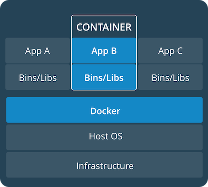
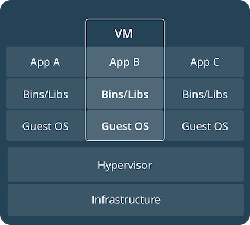

# Containers and virtual machines
A container runs natively on Linux and shares the kernel of the host machine with other containers.
It runs a discrete process, taking no more memory than any other executable, making it lightweight.

By contrast, a virtual machine (VM) runs a full-blown “guest” operating system with virtual access to host resources through a hypervisor.
In general, VMs incur a lot of overhead beyond what is being consumed by your application logic.

 

# 设置 docker 环境
- 下载并安装 docker desktop
- `docker --version` 检查安装版本
- `docker run hello-world` 运行一个容器
- `docker image ls` 查看本地镜像
- `docker ps` 查看启动的容器，`docker ps --all` 查看所有容器

# Linux CentOS 8 安装 Docker
官方安装文档：

https://docs.docker.com/install/linux/docker-ce/binaries/#install-static-binaries

https://docs.docker.com/install/linux/docker-ce/centos/#install-docker-ce

- 直接 yum install 会遇到一个很棘手的问题：No available modular metadata for modular package 'container-selinux-2:2.124.0-1.module_el8.2.0+305+5e198a41.noarch', it cannot be installed on the system
- 原因是 container-selinux-2.124.0 这个依赖无法自动安装
- 以下是安装方式：(以下所有安装包在 packages 目录下都能找到)

首先准备好 container-selinux-2.124.0.noarch.rpm 这个包并安装

准备好以下的rpm包：

https://download.docker.com/linux/centos/7/x86_64/stable/Packages/<br><br>

containerd.io-1.2.6-3.3.el7.x86_64.rpm

docker-ce-19.03.8-3.el7.x86_64.rpm

docker-ce-cli-19.03.8-3.el7.x86_64.rpm

docker-ce-selinux-17.03.3.ce-1.el7.noarch.rpm(这个暂时不用装)

- 安装顺序：

yum install container-selinux-2.124.0.noarch.rpm

yum install containerd.io-1.2.6-3.3.el7.x86_64.rpm

yum install docker-ce-cli-19.03.8-3.el7.x86_64.rpm

yum install docker-ce-19.03.8-3.el7.x86_64.rpm

- 启动：

service docker start

- 查看docker信息：

docker version

- 停止服务：

service docker stop

- debug：

dockerd --debug

- 配置文件：

/usr/lib/systemd/system/docker.service

配置 insecure-registries: /etc/docker/daemon.json
```shell

```

配置文件修改后记得重启docker生效

- 登录远程镜像仓库

docker login repo.url -u xxx -p xxx

- 测试：

docker run hello-world

- 容器存储目录

/var/lib/docker/containers

- 卸载：

yum list installed |grep docker

rpm -qa |grep docker

yum remove docker-ce.x86_64

yum remove docker-ce-cli.x86_64

yum list installed |grep containerd.io

yum remove containerd.io.x86_64

- 可以用rpm卸载：

rpm -e containerd.io

rpm -e containerd.io --nodeps

之后还原/usr/bin/runc，用安装之前备份的文件还原，如果原来有

- 删除docker镜像

rm -rf /var/lib/docker

参考文档：https://blog.csdn.net/haveqing/article/details/105277605

# 构建并运行自己的 image
开发流程：
- 为应用程序的每个组件创建和测试单独的容器，构建镜像.
- 组装你的containers和要支持的基础架构到一个完成的应用程序中.
- 测试，发布，部署完成的容器化应用程序.

1. 下载一个简单应用
```
git clone https://github.com/dockersamples/node-bulletin-board
cd node-bulletin-board/bulletin-board-app
```
2. Dockerfile 定义一个 container
3. build
```
docker build --tag bulletinboard:1.0 .
docker push bulletinboard:1.0
```
4. run image as a container
```
docker run --publish 8000:8080 --detach --name bb bulletinboard:1.0
```
- `--publish`：将主机端口8000的流量转发到容器的8080端口.
- `--detach`: 后台运行容器
5. 访问 `http://localhost:8000/`
6. `docker rm --force bb`
`--force` 停止并删除容器


# 发布 image
1. 创建 Docker Hub 账户
2. 使用 docker login 或者 docker desktop 界面登录
3. 创建 Docker Hub repository
4. 打标签：`docker tag bulletinboard:1.0 <Your Docker ID>/bulletinboard:1.0`
镜像命名：<Your Docker ID>/<Repository Name>:<tag>
5. push: `docker push <Your Docker ID>/bulletinboard:1.0`

