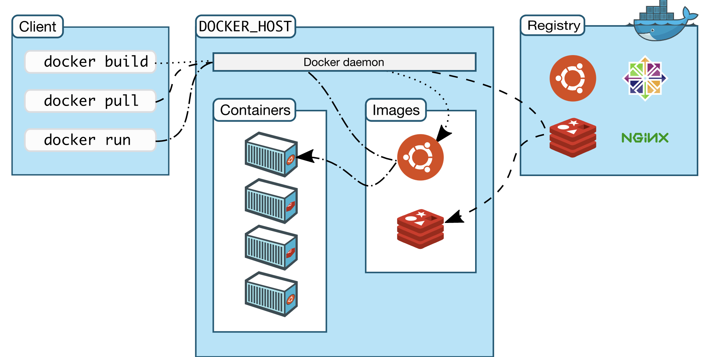

# Docker
Docker是一个用于开发、交付、部署应用程序的平台。Docker 能够将应用程序和基础架构分离从而实现快速软件交付。Docker快速交付、测试和部署代码，显著提升软件开发速度。

## Docker 容器
Docker 是一种容器技术，使用 Docker 可以在宿主机同时运动多个互相隔离的容器，container 直接运行在宿主机的内核，是一种更轻量级的隔离技术。

Docker提供了工具和平台来管理容器的生命周期：
- 使用容器开发应用程序及其支持组件components；
- 使用容器分发和测试应用程序；
- 应用程序作为容器或协调服务部署到生产环境中，无论您的生产环境是本地数据中心，云提供商还是两者的混合，其工作原理都相同。

## Docker 安装
    转到 Get_started/docker_engine.md 路径下

## Docker engine
Docker engine 是一个 client-server 应用，包含3个组件：
- server ：后台daemon进程（使用 `dockerd` 命令）
- REST API: 程序访问daemon的接口
- CLI客户端：命令行接口客户端（`docker` 命令）

Docker CLI 通过脚本或命令行调用Docker REST API 的方式和 Docker daemon 交互，许多其他的Docker应用都依赖基础的 API 或CLI.
Docker daemon 创建和管理 Docker对象：images, containers, networks, volumes

Note: Docker已获得开源Apache 2.0许可证的许可.

## 使用 Docker 能做什么？
##### 快速、一致交付应用程序
##### 响应式部署和扩展
##### 相同的硬件运行更多的工作负载

## Docker 架构

- Docker daemon
  监听 Docker API 请求和管理 Docker 对象
  守护进程之间互相通信来管理 Docker service
- Docker client
  `docker` 命令：docker client 可以和多个守护进程通信。

  例如：`docker run`，client 发送这些命令 to `dockerd`，由 dockerd 执行。
- Docker registries
  存储 docker images 的仓库

  使用 `docker pull` 或者 `docker run`，会从配置的仓库中拉取镜像，`docker push` push 镜像到远程仓库。

  默认从 Docker Hub 拉取镜像，可以运行自己的私有仓库。

- Docker objects
    - images: 一个只读模版用于指示创建 docker 容器
    - containers：container 是镜像的可运行实例，可以create,start,stop,delete a container；可以将容器连接到一个或者多个网络，连接存储到 container，或基于当前容器状态创建新镜像。
    - `docker run -i -t ubuntu /bin/bash`:
       1. 首先拉取 ubuntu 镜像（本地无），`docker pull ubuntu`
       2. `docker container create` 创建一个 container
       3. 为该container分配一个读写文件系统
       4. Docker创建一个网络接口以将容器连接到默认网络， 包括分配给容器 IP 地址。
       5. start container 并执行 /bin/bash，-i -t 表示可以用终端进行交互：输入输出
       6. 执行 exit 会停止 container 但不会 remove，可以再次启动或者 remove container.

    - services：
      services 允许跨多个Docker daemons扩展容器，多个 managers 和 workers 作为集群一起对外提供服务。

      集群中每个成员都是Docker daemon守护程序，所有守护程序都使用Docker API进行通信。

      服务允许您定义所需的状态，例如在任何给定时间必须可用的服务副本的数量。

      默认情况下，该服务在所有工作节点之间是负载平衡的。

      对于消费者而言，Docker service 似乎是一个单独的应用程序。 Docker Engine在Docker 1.12及更高版本中支持集群模式。

## 底层技术
Docker 使用 Go 语言编写并且利用 Linux 内核许多特性来交付其功能。
##### namespaces 技术：提供隔离的工作空间即 container，启动一个 container 底层会创建一系列命名空间。
Docker Engine在Linux上使用以下名称空间：
- The pid namespace: Process isolation (PID: Process ID).
- The net namespace: Managing network interfaces (NET: Networking).
- The ipc namespace: Managing access to IPC resources (IPC: InterProcess Communication).
- The mnt namespace: Managing filesystem mount points (MNT: Mount).
- The uts namespace: Isolating kernel and version identifiers. (UTS: Unix Timesharing System).

##### Control groups
Docker Engine on Linux also relies on another technology called control groups (cgroups). A cgroup limits an application to a specific set of resources. Control groups allow Docker Engine to share available hardware resources to containers and optionally enforce limits and constraints. For example, you can limit the memory available to a specific container.

##### Union file systems
Union file systems, or UnionFS, are file systems that operate by creating layers, making them very lightweight and fast. Docker Engine uses UnionFS to provide the building blocks for containers. Docker Engine can use multiple UnionFS variants, including AUFS, btrfs, vfs, and DeviceMapper.

##### Container format
Docker Engine combines the namespaces, control groups, and UnionFS into a wrapper called a container format. The default container format is libcontainer. In the future, Docker may support other container formats by integrating with technologies such as BSD Jails or Solaris Zones.

安装 docker：https://docs.docker.com/get-docker/